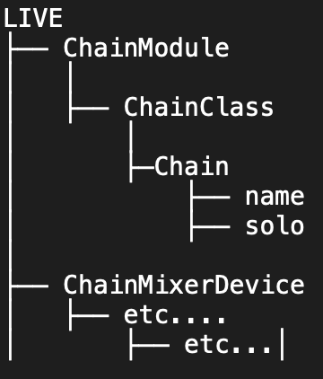

# XML to OMPL Converter for the Ableton Live Object Model Documentation

## IDEA 
Ableton LIVE is one of the most popular Music Production Softwares. 
And it has an API, which you can use via a Control Surface Script or with the bundled Software MAX DSP.

You can pretty much control every aspect of a live set (a song/document) through this API, which is also called Live Object Model

However, the documentation is confusing and hard to work with. There are two sources, one is on the website of the MAX for Live Documentation and an unofficial one, made by Julien Bayle with the help of a script called LiveAPI_MakeDoc, which puts out all accessible API points in a XML file.

Here is a link:

the script: 
[https://github.com/NSUSpray/LiveAPI_MakeDoc](https://github.com/NSUSpray/LiveAPI_MakeDoc)
and the resulting xml file:
[https://structure-void.com/PythonLiveAPI_documentation/Live11.0.xml](https://github.com/NSUSpray/LiveAPI_MakeDoc)

Those Control Surface Scripts are programmed in Python, which was the main reason for me to take this course in CS50. (And I liked it a lot)

My idea was to bring this document into a format which is much more easy to overview. I really like the way MindMaps have foldable branches. I use the software XMind. It can't import xml files, but OPML was an importable format.

I thought writing a code to transform this xml data structure into the OPML Format is a good idea. In the future features probably will be added in the API and all you have to do then is to run the programm and have a beautiful documentation.

## Methodology and steps
It was obvious me that it would be best to use OOP for this to store everything into a class and have methods to come with it.

### 1) import the data from the xml file
I used the library xml.etree.ElementTree to import the data into one list. 

**Data Structure**
Objects (or Modules) have Children, Methods, Properties, Sub-Classes, Listener. Those will be used to group elements together.
I used keywords, tags to break the elements into the different pieces, regarding type of object, path and description and stored them into a dictionary with a unique id as a reference.

The hierachy of the xml files is flat though.
e.g. 
Live.ChainModule
Live.Chain.ChainClass
Live.Chain.Chain.name
Live.Chain.Chain.solo

What I wanted is to build a tree structure with correct relationships:

### 2) Referencing and building a tree structure
I then searched each element and referenced in both directions parent and children, so it is possible to climb between branches up and down.

The build_tree_recursive_with_groups_as_children function constructs the hierarchical tree structure, where elements are organized based on their parent-child relationships. Groups are treated as special nodes that group related elements together.

The TreeNode class is a fundamental part of the tree structure. Each node in the tree is represented by an instance of this class. It has the following attributes:

data: Stores information about the LOM element associated with this node.
children: A list of child nodes, representing the elements nested beneath the current element.
The TreeNode class is used to build a hierarchical representation of the LOM, where each node corresponds to an element in the LOM XML.

### 2b) grouping listener() Methods
many objects in the LOM have listener methods, which will be called, if this objects changes. Each listener has three methods:
add_listener()
remove_listener()
_has_listener()

To improve the overview, I wrote a function summarize_listener_methods() which "collects" those three methods and sort them by the actual listener name.

### 3) write the opml file for XMind
I build the desired structure in XMind with a very few elements manually, using XMind specific features like:
- note for the description 
- label to indicate the type of element

Then I exported it as a OPML file and re-engineered the outline formatting to match those features:

`‌outline = f'{indent}<outline text="{name}" _note="{description}" type="label" _label="{tag}">\n'`

## Testing (test_AbletonLOM.py)
I did the testing procedures after everything worked. Given that the xml file input is static, because it is actually always the same file, there was no need to test to code for unexpected input.

But as the requirements for this projects are demanding some unit tests, I wrote tests for the parsing of the LOM paths, the parsing of listener methods and the cleaning of the description for XMind

## Outcome, plans and summary

It works perfectly for my use case. Now it is a real joy to look for certain aspects. 
I have one plan for the future:

I want to make it accessible for the ableton community. I think the best way is to use my output side of the program to build a folder structure for a 
   static site generator like hugo to make it fast and accessible for the web.

Update: while programming this, a friend of mine updated the original LIVEAPI Make doc script to Python 3, and now it can run on Ableton 11.3. as well as on the 
Live 12 beta, which is not even released officially:
[https://github.com/Enteleform/LiveAPI_MakeDoc](https://github.com/Enteleform/LiveAPI_MakeDoc)

Thank you David Malan and everybody else at CS50 at Harvard, it has been a great journey to dive into Python programming. The results will be very beneficial for my workflow!

